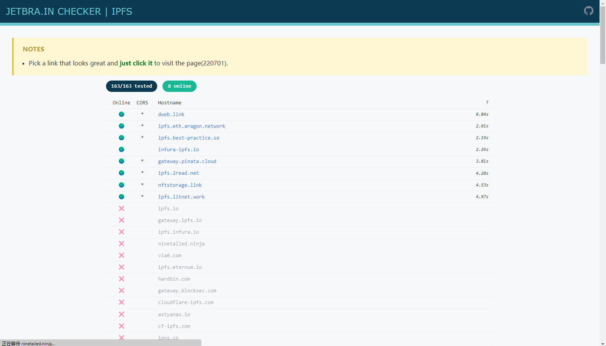
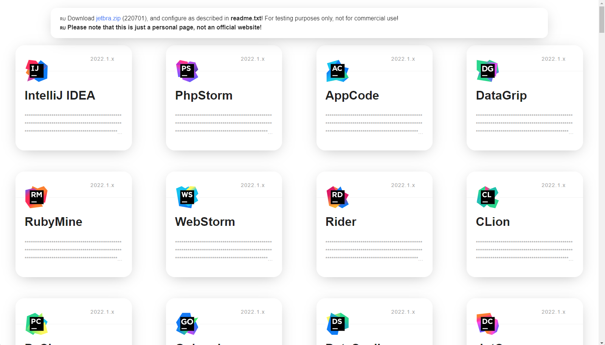
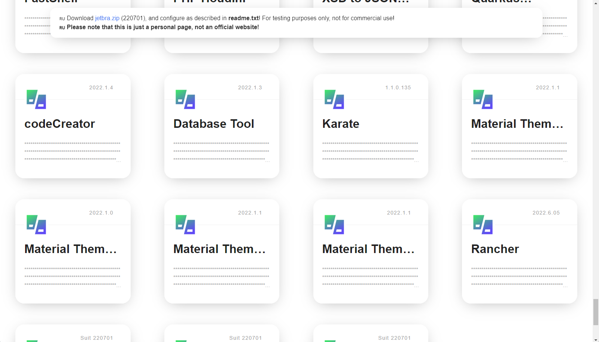
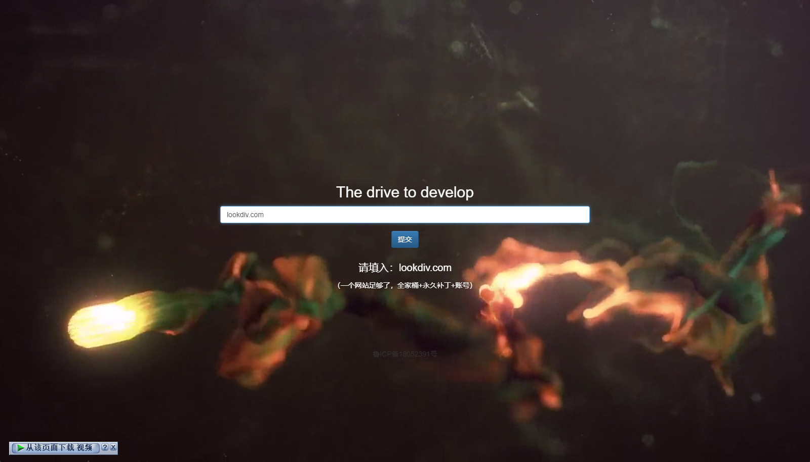
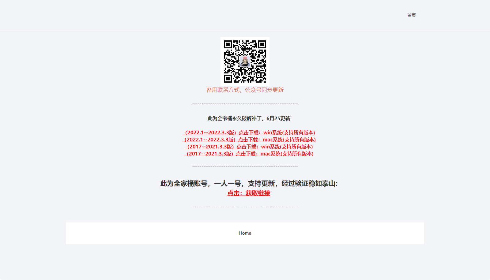

# idea_activate

JetBrains全家桶激活 JetBrains 2017-2022所有版本激活 idea激活  phpstorm激活 pycharm激活 webstorm激活 AppCode激活 Goland激活 Rubymine激活 clion激活 datagrip激活 ride激活

## 最新破解下载网址

## ① ja-netfilter-all（推荐）  https://3.jetbra.in







### 使用方法: 
```
1. 进入 ja-netfilter-all\scripts 文件夹
2. 自动激活
	macOS 或 Linux: 	执行 "scripts/install.sh"
    Windows: 		 双击执行 "scripts\install-current-user.vbs" (当前用户)
                             "scripts\install-all-users.vbs" (对所有用户)
3. 如果仍然提示输入激活码，进入 ja-netfilter-all\code 文件夹，找到对应软件或插件的激活码进行激活
4. 最新全家桶激活码以及所有付费插件激活码 请访问 https://3.jetbra.in

```

### Operation guide: 
    1. add -javaagent:/path/to/ja-netfilter.jar=jetbrains to your vmoptions (manual or auto)
    2. log out of the jb account in the 'Licenses' window
    3. use key on page https://jetbra.in/5d84466e31722979266057664941a71893322460
    4. plugin 'mymap' has been deprecated since version 2022.1
    5. don't care about the activation time, it is a fallback license and will not expire

Enjoy it~

### JBR17:
​    add these 2 lines to your vmoptions file: (for manual, without any whitespace chars)
​    --add-opens=java.base/jdk.internal.org.objectweb.asm=ALL-UNNAMED
​    --add-opens=java.base/jdk.internal.org.objectweb.asm.tree=ALL-UNNAMED

### NEW: 
​    Auto configure vmoptions:
​        macOS or Linux: execute "scripts/install.sh"
​        Windows: double click to execute "scripts\install-current-user.vbs" (For current user)
​                                         "scripts\install-all-users.vbs" (For all users)


## ② http://lookdiv.com/




